# 春之石 Shard of Spring — 逆向工程 + Go remake + 繁體中文化

SSI《Shard of Spring》(1986 / 1987,MS-DOS 版由 Digital Illusions 移植)的
**完整逆向工程紀錄**,以及在其上重寫的引擎與繁體中文翻譯。

**這個 repo 是 private**,收錄了 `cmd/convert` 轉出的資產(`assets/`)與含原版
美術的引擎截圖 —— 專案負責人裁定([`CLAUDE.md`](CLAUDE.md) §8)。
⛔ **原版磁片的內容本身**(`game/`、`original/`)仍然不進版控。

⚠ **repo 收錄 ≠ 發行附帶。** 公開發行的產物只有引擎程式碼與翻譯文本,
玩家自備合法原版、自己跑轉換器。

---

## 這個專案留下了什麼

一款 1986 年的遊戲,原始碼早已不存在。留下來的是**規則本身** ——
從機器碼一條一條讀出來、寫成規格、再用現代語言重寫回去。

| 產出 | 量 | 量法 |
|---|---:|---|
| 逆向工程筆記 | **232 篇** | `ls docs/re/*.md` |
| 收斂的子系統 | **12 / 12** | [`CLAUDE.md`](CLAUDE.md) §2.2 看板 A–L |
| 規則資料 | **33 個法術 / 74 種怪物 / 57 件道具** | `assets/data/*.json`,欄位語意逐欄對過 |
| 原版文字盤點 | **1,476 段 / 34,499 B** | [`re/62`](docs/re/62-l-localization-inventory.md)、[`re/63`](docs/re/63-userlib-strings-and-l-correction.md) §4 |
| 引擎 | **19,927 行 Go** | `find engine -name '*.go' ! -name '*_test.go'` |
| 測試 | **14,269 行 / 504 條** | 兩套字型後端各跑一次(預設 TTF 與 `-tags eten`)|
| 發行 | **Windows / Linux / macOS** | [`tools/release.sh`](tools/release.sh) |

解出來的不只是檔案格式。**命中、傷害、經驗值、升級、法術效力、遭遇組成、
戰後金幣**這些規則,原版手冊全都沒寫 —— 它們現在有算式,而且每一條都指得出
是哪一支執行檔的哪一個位址。

⚠ **RE-DONE 不等於零疑問。** 十二篇收斂筆記各自附一張「明列剩餘的不確定」,
還開著的三件事列在[下面](#還開著的三件事)。

---

## 現在長什麼樣

### 手繪冒險書現代主題（F6 切換）

視覺與配樂分開：`F6` 切換「原版／手繪冒險書」，`F5` 繼續切換
「原版／重製／關閉」配樂，因此可以自由混搭。現代主題是明確標示的重製增補，
不取代原版忠實畫面的驗收基準。

| | |
|---|---|
| 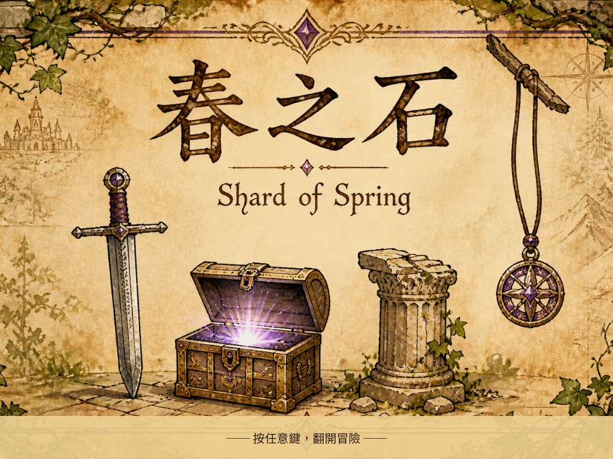 | 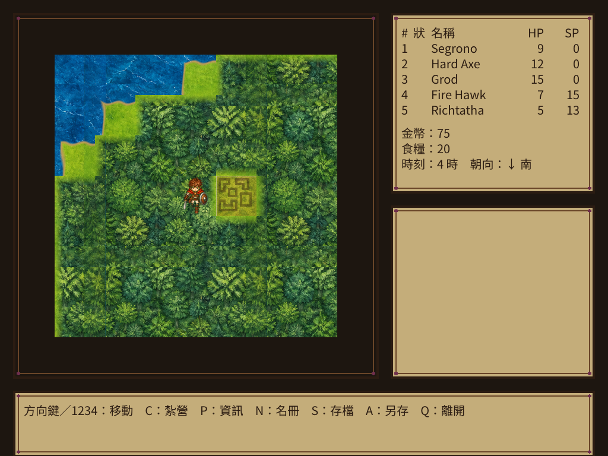 |
| **現代標題／logo** —— 劍、寶箱、殘柱與紫色護符改繪成冒險書扉頁 | **現代世界地圖** —— 68×68 水彩圖塊與四方向、兩步態角色 sprite |
| 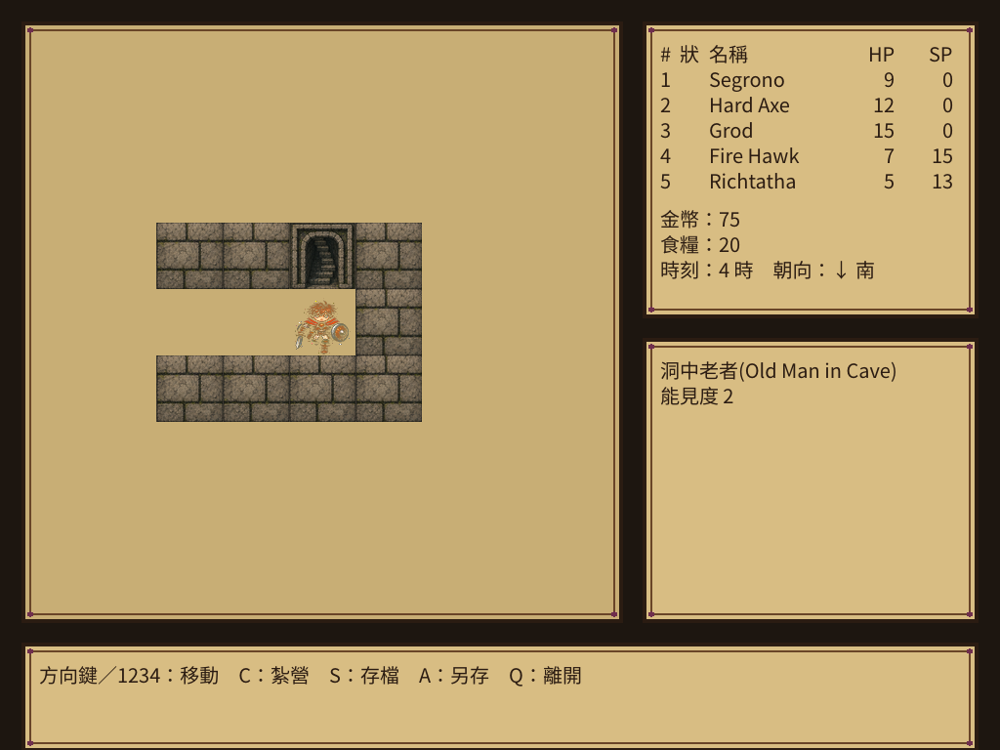 | 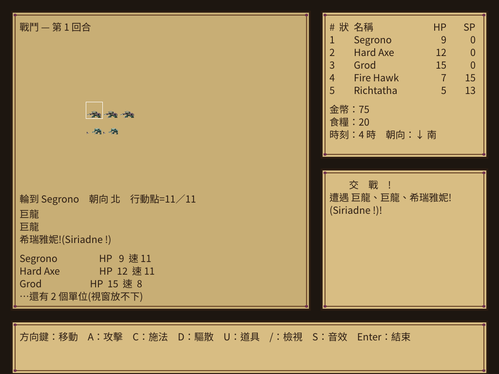 |
| **現代迷宮** —— 暖灰石材、苔色與魔法紫／青色 | **現代戰鬥** —— 22 組手繪怪物 sprite，規則與格位完全不變 |

美術規格、資產契約與權利紀錄見
[`docs/spec/24-modern-storybook-theme.md`](docs/spec/24-modern-storybook-theme.md) 與
[`art/modern/README.md`](art/modern/README.md)。

### 原版忠實主題

| | |
|---|---|
| 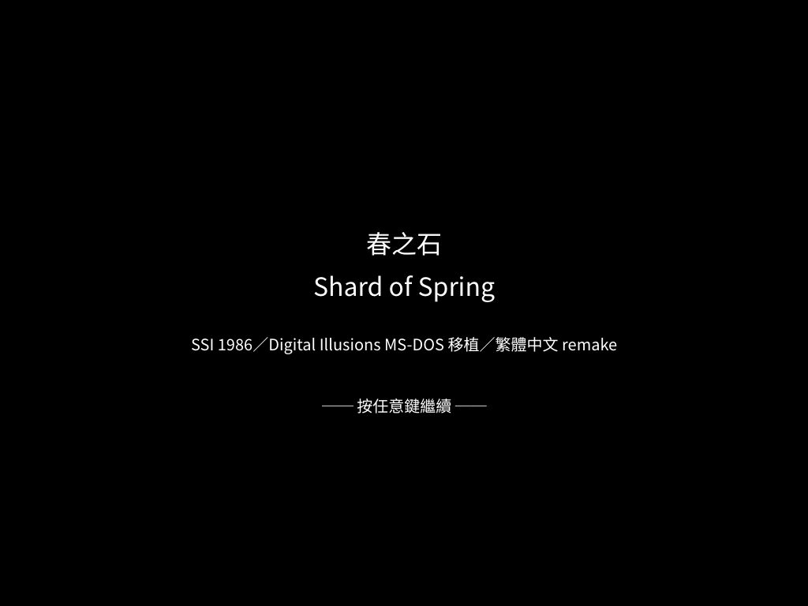 | 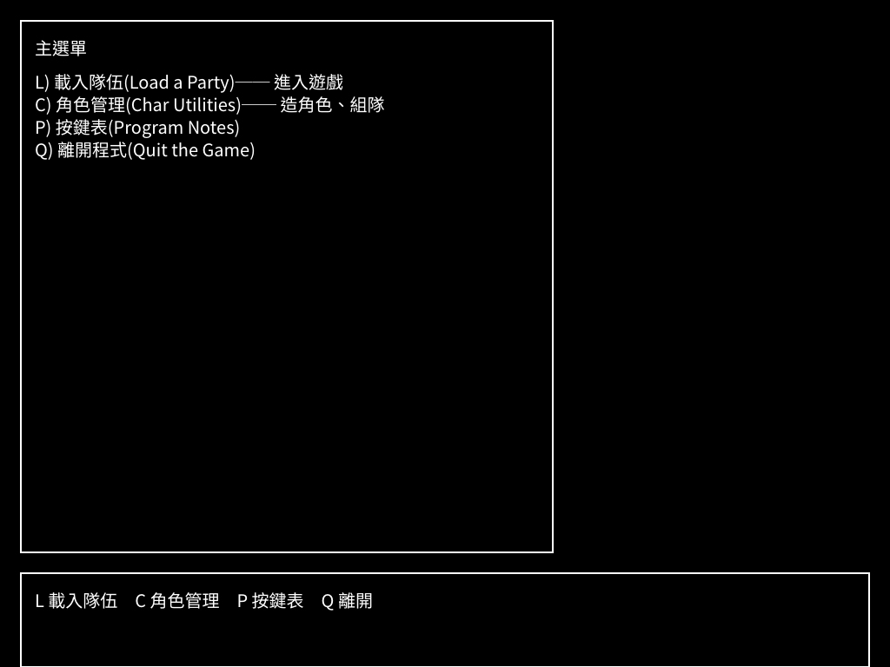 |
| **標題畫面** | **主選單** —— 逐項對應原版的 `L)oad a Party` / `C)har Utilities` / `P)rogram Notes` / `Q)uit`。⚠ 原版**沒有「開新遊戲」**([`spec/15`](docs/spec/15-game-shell.md) §1)|
| 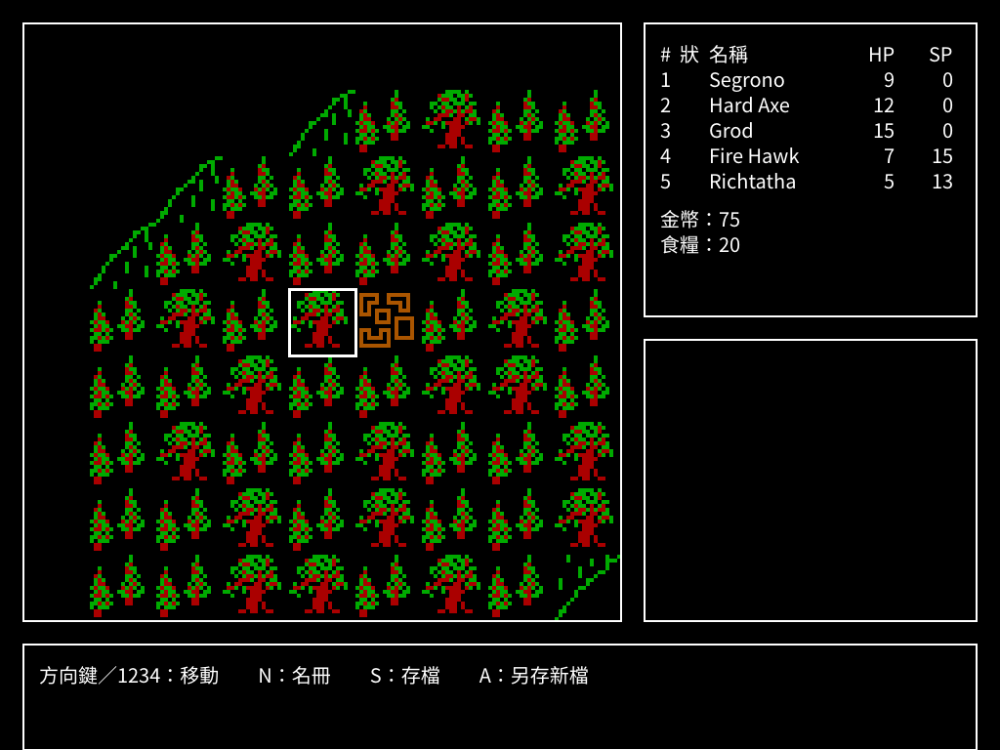 | 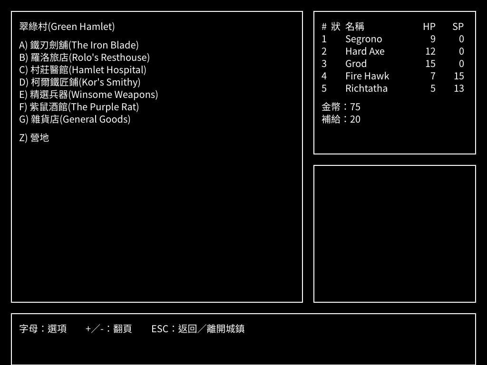 |
| **世界地圖** —— 121 × 103 格,9×9 視野,圖塊 4× 整數放大 | **城鎮**(翠綠村)—— 建築清單、商店、旅店、酒館、訓練所、治療所 |
| 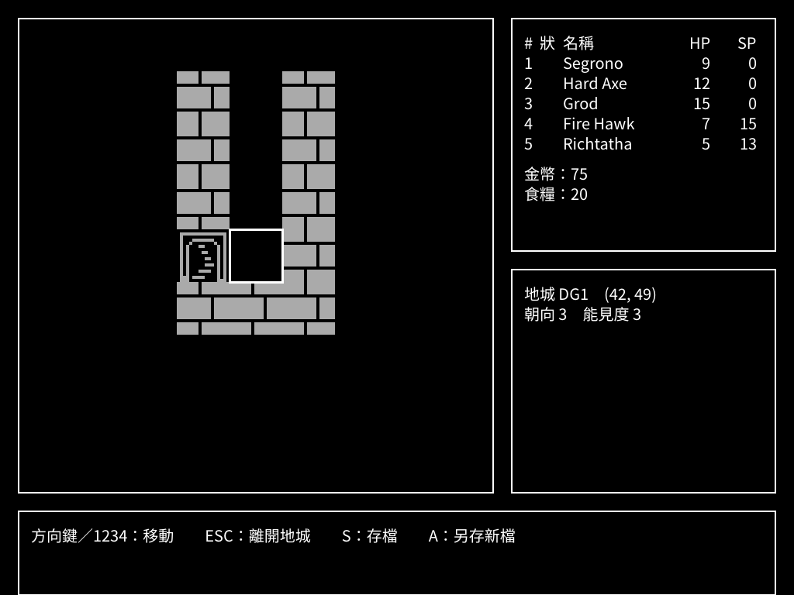 | 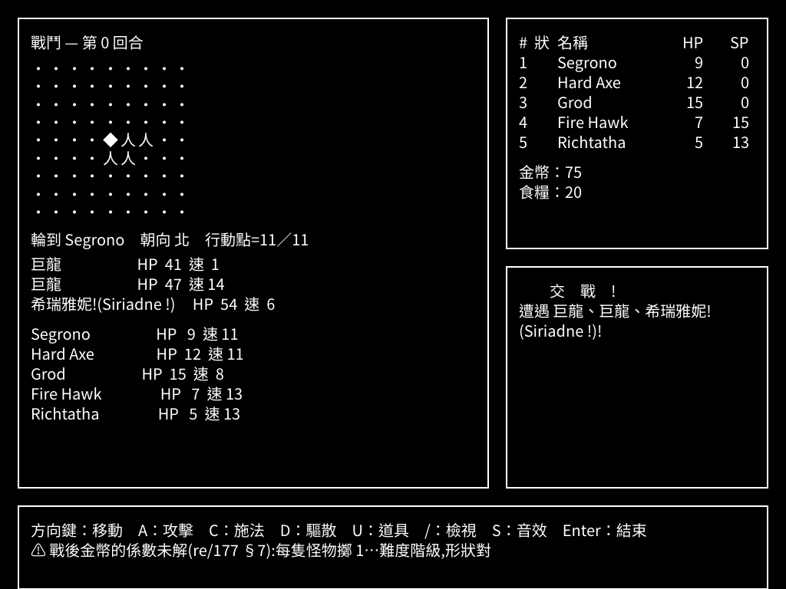 |
| **地城** —— 六座迷宮、能見度裁視野、事件表。左上角的地城名對照[入口表](docs/re/222-dungeon-names-by-entry.md) | **最終戰** —— 巨龍 ×2 + 希瑞雅妮。這個組成是[反組譯](docs/re/180-scripted-fight-monster-list.md)與[通關紀錄](docs/re/179-final-battle-composition-from-playthrough.md)**兩條獨立證據鏈**得到的同一個答案 |
| 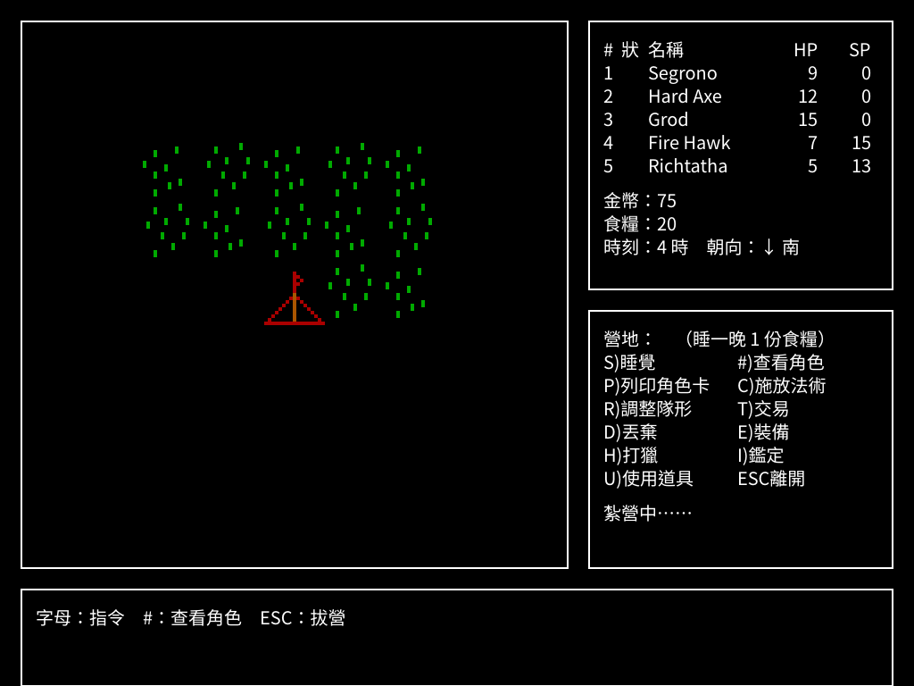 | 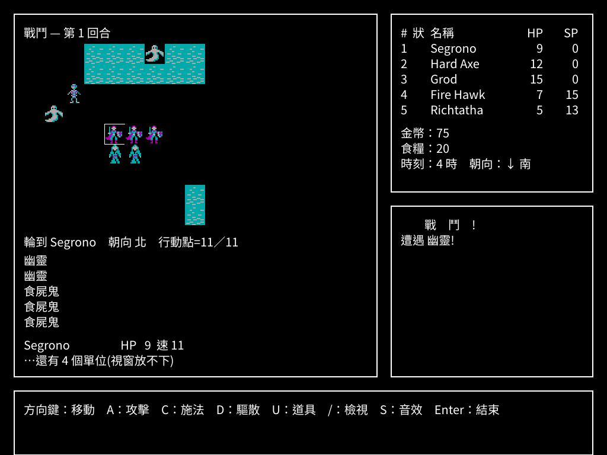 |
| **野外營地** —— 地圖留著、隊伍那一格換成帳篷、十一個指令開在右下角那個框,照原版的版面 | **海邊的隨機遭遇** —— 一場是**一群**、會混種([`re/225`](docs/re/225-encounter-monster-count-anchor.md):遭遇表是 `RNDMONST.BIN`),戰場鋪出**水面**([`re/227`](docs/re/227-fastcmbt-is-nine-get-arrays.md):來源是隊伍周圍的 3×3 地圖格)|

> ⚠ **截圖與 `assets/` 都含原版美術。** 這讓「repo 維持 private」
> ([`CLAUDE.md`](CLAUDE.md) §10)變成整個專案**最吃重的一條** ——
> 一旦轉 public,洩漏的是原版的資料與美術本身。

### 推廣影片

[`docs/promo/shard-of-spring-cht-promo.mp4`](docs/promo/shard-of-spring-cht-promo.mp4)
—— 標題、主選單、`F6` 原版／手繪冒險書切換、世界地圖、城鎮、地城、最終戰，
接一段**原版 vs 重製版**的並排比較，最後兩張定格交代這個專案做了什麼。
全片約 57 秒，配樂使用本專案為各場景創作的重製曲。

⚠ 比較段左邊的原版畫面是 [`tools/dosbox_run.sh`](tools/dosbox_run.sh) **實跑抓的**
(路線見 [`re/139`](docs/re/139-oracle-reaches-gameplay.md)),不是掃描或網路上的圖 ——
兩邊都得是自己跑出來的,比較才成立。三組:標題、主選單、世界地圖。標題那一組是**同一張 CGA 美術**
(`STARTUP.BIN` 轉出來的),世界地圖那一組是**同一支隊伍、同一個位置**。

⚠ **畫面是真的按鍵驅動錄出來的**(`engine/promo_test.go` 每格寫一張 PNG),
不是擺好狀態的定格 —— 推廣片要證明的是「玩得動」,而定格不是那個證據。
重錄:`tools/promo.sh`。

⚠ 影片含**原版美術**,與 `docs/images/` 同一個地位:private repo 下沒有問題,
**對外散布是另一件事**,要專案負責人另行決定。

---

## 從哪裡開始讀

| 檔案 | 內容 |
|---|---|
| **[`CONTEXT.md`](CONTEXT.md)** | **單一入口** —— 現況、文件索引、術語表、**已被推翻的斷言** |
| [`docs/PLAYING.md`](docs/PLAYING.md) | **要玩的人看這一份** —— 自備原版怎麼轉檔、存檔在哪、常見問題 |
| [`docs/column-shard-of-spring.md`](docs/column-shard-of-spring.md) | **這款遊戲是什麼、當年在台灣怎麼賣的** —— 含精訊 1987 中文說明書的一手證據 |
| [`docs/spec/14-remake-worklist.md`](docs/spec/14-remake-worklist.md) | **「還剩什麼沒做」的單一真相來源** |
| [`CLAUDE.md`](CLAUDE.md) | 目標、RE 深度邊界、動工閘門、工具鏈、硬規則 |
| [`docs/re/`](docs/re/) | 232 篇分析筆記,編號即閱讀順序 |
| [`docs/spec/`](docs/spec/) | 收攏後的實作規格,標 READY 才能動工 |

新接手的人讀 `CONTEXT.md` 就能重建全局。

## 目前進度

**可以從頭玩到通關,三平台都有發行版。**

| 階段 | 狀態 |
|---|---|
| **逆向工程** | ✅ 結束。[`CLAUDE.md`](CLAUDE.md) §2.2 看板的**十二個子系統全部 RE-DONE**,規格標 READY。`docs/re/` **232 篇**筆記 |
| **引擎** | ✅ 世界地圖、地城、戰鬥、戰場、法術、道具、城鎮、商店、營地、名冊、創角、訓練、治療、經驗、技能點、音樂、音效都實作了。原版忠實與手繪冒險書主題可用 `F6` 獨立切換；共 **19,927 行 Go + 14,269 行測試（504 條）**。⚠ 兩條規則明確地**沒有**實作(見下面「與原版的差異」),而且標在遊戲畫面上 |
| **繁體中文化** | ✅ 資料檔 439 段(怪物 74 / 法術 33 / 道具 57 / 地城 87)＋ 模組內字串 **381 / 381 全部譯完並接回引擎** |
| **打包發行** | ✅ `v0.5.1`(2026-08-21):Linux **AppImage** / Windows zip / macOS universal 三平台完整包已在本機重建並驗證；本版修正現代角色比例、怪物 atlas 分割與土黃色亮度。建立 GitHub Release 是另一項外部發布操作。`tools/release.sh` 一鍵三平台。存檔相容,**不必重轉資產**。<br>要把已發布的三平台包、release notes、推廣片集中到一個目錄交出去:`tools/dist_all.sh` → `dist-all/`(gitignore)。⚠ 它從 GitHub release **原樣下載**、與本機建出來的逐檔比 SHA-256,並把三個包都翻開確認**沒有 `assets/`** |
| **對照原版三輪 QA** | ✅ 用 DOSBox 跑原版逐畫面比對,三輪共約 55 條。規則層只錯四條,而**四條都沒有症狀** —— 升級門檻、迷宮兩軸、地城遭遇、創角重擲上限([worklist](docs/spec/14-remake-worklist.md) §12)|
| **還開著的** | 場景架構重構 C2 的[重啟判準量過了、未達成](docs/spec/14-remake-worklist.md)，照規則不動；現代主題的發行產物與推廣片則以本次 `v0.5.1` 收尾 |

進度的單一真相來源是 [`docs/spec/14-remake-worklist.md`](docs/spec/14-remake-worklist.md),
⛔ 不要從這裡複製狀態。

## 移植完整度自評(2026-08-20)

判準先講清楚,不然「完整」這兩個字沒有意義:

> **本專案說的「完整」= 凡是從原版讀出來的規則與資料,都在引擎裡實作了,
> 而且沒有一項是猜的。**

這個判準有一個**已知的弱點**:它只管分子,不管分母 ——
「讀出來多少」本身沒有上界可以對照。本輪就吃了一次:原版的**戰鬥音效**
存在了四十年,而專案的音樂盤點掃的是 `PLAY` 的樂譜字串,
音效走的是 `SOUND`,那個掃法**結構上就看不到它們**
([`re/228`](docs/re/228-combat-sound-effects.md))。所以下表的每一列都附
**判準與證據**,而不是一個百分比。

| 層 | 自評 | 判準與證據 |
|---|---|---|
| **規則** | **完整** | 十二個子系統全部 RE-DONE(四項條件逐條核對);`combat.Unresolved` 現在是**空的**;三輪 DOSBox 逐畫面對照約 55 條,規則層只錯四條而且都修掉了 |
| **資料** | **完整** | 原版 100 個檔案:69 個由 `cmd/convert` 直接讀進 `assets/`;其餘 31 個**逐個有交代** —— 11 支 EXE 是程式碼、9 個 `.MST` 與 `.BIN` 逐 byte 相同([`re/181`](docs/re/181-deeff-mst-is-the-master.md))、9 個 98-byte 圖塊已包在 `FASTCMBT.BIN` 裡([`re/227`](docs/re/227-fastcmbt-is-nine-get-arrays.md))、`CONFIG.SOS` 是顯示模式設定、`TITLES.DAT` 的選單字串已譯完並**直接寫成引擎的畫面文字**(不經轉換器)|
| **美術** | **完整** | 世界地圖 12,463 格 **100% 有來源**,畫面上沒有佔位符;22 隻怪物圖、5 張大圖、圖塊群、人形段、戰場地形都轉得出來且與原版對得上 |
| **畫面與流程** | **完整** | 16 個場景,每一個都有「按下去有反應」的測試;可以從讀檔一路玩到通關。⚠ 十三項版面差異逐項比對過,其中**四項刻意不改**(理由都是「原版沒有的功能需要原版沒有的回饋」) |
| **中文化** | **完整** | 資料檔 439 段、模組內字串 **381 / 381** 全部譯完並接回引擎;`tools/check_ui_language.py` 量到 0 條殘留英文 |
| **音樂** | **完整** | 原版只有兩首(通關、全滅),兩首都逐字照抄原版字串、走同一個方波合成器。另加六首**非原版**的場景配樂,預設關閉 |
| **音效** | **部分** | 七個代碼的波形全部照抄,**觸發點只接四個**(命中、劈砍、死亡、施法)。`BP` 與 `FL` 的十個呼叫端[逐條讀過了](docs/re/228-combat-sound-effects.md#6-bp-與-fl-逐條讀過了--結論是不接),結論是**不接** —— 兩種讀法都與觀察相容而接到的位置相反。⛔ 不猜位置硬接 |
| **亂數序列** | **明確不做** | 專案負責人裁定。引擎用自己的 RNG,同一個種子在引擎內可重現,但與原版不同 |

⚠ 表上量的是**還原**。另有兩項是**原版沒有、重製版加的**:
六首場景配樂(預設關閉)與**商店賣出**(收購價 65%)。
兩項都在畫面上標明是增補 —— **玩家沒有辦法自己分辨哪些是 1986 年就有的**,
所以標示是這類增補的入場條件,不是禮貌。

### 還開著的三件事

| 項目 | 為什麼還開著 |
|---|---|
| 音效的 `BP` / `FL` | 十個呼叫端**讀完了**,但兩種讀法(「做不到」vs「做完了」)都與觀察相容,而它們接到的位置相反。**剩下的問題已縮小成一次 DOSBox 實跑**:開音效,分別做一次「點數足夠的移動」與「點數不足的嘗試」,聽哪一次嗶 |
| 商店的 `PERSUASIVENESS` 折扣 | 技能怎麼影響價格未解,價格未套用它 —— 標在商店畫面上 |
| 營地「在野外」的判斷 | 原版看 `ds:3534 ≥ 99`,那個變數的來源未解;引擎改用「營地開在哪裡」 |

⚠ 三項都**標在遊戲畫面上**,不是只寫在文件裡。
「⚠ 某某未解」比沒有這張表更糟的情況只有一種:標在錯的畫面上 ——
在營地看到「原版沒有賣出功能」的人會去找營地哪裡可以賣東西,
而真正該看到它的買家在商店什麼都沒看到。那個錯誤發生過,已經修掉。

### 這份自評怎麼被推翻

最可能的方式不是「某一條規則寫錯了」,而是**又一個像音效那樣的整片缺口** ——
一個分類方式看不到的東西。防它的方法只有一個:
問「有沒有 X」的時候先問**「X 如果存在,會長成什麼樣子」**。
樂譜長成字串所以副檔名清單看不到它,音效長成 `SOUND` 所以樂譜清單看不到它。

---

## 與原版的差異

規則層的目標是**一致**;差異集中在載體、呈現與現代環境的必要調整。

| | 原版(1986/1987 MS-DOS) | 這個重製版 |
|---|---|---|
| **遊戲規則** | — | **一致** —— 命中、傷害、經驗曲線、升級成長、法術效力、遭遇、可通行性、事件都照反組譯結果實作,並用 DOSBox 跑原版逐畫面驗過三輪 |
| **亂數序列** | 自己的 RNG | **不重現**([裁定](docs/spec/14-remake-worklist.md) §9)。同一個種子在本引擎內可重現,但與原版不同 |
| 執行方式 | 九支 EXE 靠 `retf` 互相轉交,共用 `BRUN30` 執行期模組 | 單一執行檔,九個場景共用一份狀態 |
| 畫面 | CGA 320×200,四色 | 1024×768。原版主題以 **4× 整數放大**保留四色；另有內嵌的**手繪冒險書現代主題**，`F6` 獨立切換，預設原版 |
| 語言 | 英文 | 繁體中文。譯名以**精訊**版為主([glossary](translations/glossary.md)) |
| 存檔 | 直接改 `CHARS.DAT` / `GROUPS.DAT` | **自己的 JSON 格式**,多存檔。⛔ 不寫回原版檔案。可匯入原版存檔 |
| 音樂 | 兩首 PC 喇叭方波(通關、死亡),其餘場景**沒有背景音樂** | 同樣兩首 **+ 六首場景配樂**,**F5 切換原版/重製/關閉,預設原版**([spec/13](docs/spec/13-sound.md) §7) |
| 音效 | 戰鬥有七個 `SOUND` 音效,`S` 鍵開關([`re/228`](docs/re/228-combat-sound-effects.md))| 波形七個全部照抄,**觸發點接四個有證據的**(命中/劈砍/死亡/施法);`BP`/`FL`/`BR` 的呼叫端語意沒讀完,不接 |
| 開機防拷 | 手冊查表題 | 保留流程,**按 Enter 就過**。⛔ 不從程式裡取出答案自動通過 |
| 商店賣出 | **沒有這個功能**([`re/142`](docs/re/142-town-service-prices.md) §4)| **重製版增補**:收購價 = 該店售價的 **65%**,只有商店收、只收自己賣的範圍、裝備中的要先卸下。⚠ 畫面上明寫這是增補([spec/14](docs/spec/14-remake-worklist.md) §13.7)|
| 按鍵 | 小鍵盤模板(`2/4/6/8` 移動、`0` 攻擊…)| 方向鍵為主,原版的字母鍵保留;少數位置不同會標在提示列 |
| 印表機輸出 | `P)rint` 走印表機 | 改成畫面顯示 |
| 遊戲資料 | 隨磁片附帶 | **不附帶**。玩家自備合法原版,跑一次轉換器 |

還有一類差異是**誠實標記**而非模仿:少數細節沒有讀到的地方,引擎**不猜**,
而是把缺口寫在遊戲畫面上。目前畫面上標著三條,清單在
[上面的自評](#移植完整度自評2026-08-20)。

⛔ 一條都不湊一個看起來合理的值 —— 湊了就等於自己發明規則,而玩家看不出來。
這張清單**會縮短**:一場遭遇的隻數與怪物施法的投入都曾經在上面,
[`re/225`](docs/re/225-encounter-monster-count-anchor.md)、
[`re/226`](docs/re/226-monster-cast-invest-and-target.md) 解出來之後就撤了。

[`re/218`](docs/re/218-four-named-assumptions-audited.md) 逐條查證掉四項舊的具名假設,
**其中一項的問題本身不成立** —— 原版根本沒有「法術等級」這個量,是規格多寫了一個中間量。

### 怎麼跑

```bash
# 一律走 docker,不裝系統 Go(CLAUDE.md §8)
# assets/ 已經在 repo 裡;要重新轉(改了轉換器時)才需要這一行
tools/go.sh run ./cmd/convert -in /game/sharspri -out /out
tools/go.sh build && ./build/shard -assets assets
tools/go.sh test -count=1      # ⚠ 一定要帶 -count=1,見下
```

⚠ **測試一定要帶 `-count=1`。** `package main` 匯入 ebiten 會在 `internal/ui`
的 `init()` 呼叫 `glfw.Init()`,沒有 `DISPLAY` 就 panic —— 那發生在任何測試
跑起來之前。`tools/go.sh` 已經內建 Xvfb,但**一旦有過一次成功結果進 build cache,
`go test` 就回 `ok (cached)`,綠燈是快取在說話**。

---

## 這個專案的核心紀律

[`CLAUDE.md`](CLAUDE.md) §2.1 定義 **RE-DONE** 要四項條件同時成立:
在 IDA 讀過原始指令、用 xref 確認讀寫端、**有一份獨立資料互相印證**、
筆記標明輸入檔與信心等級。

信心等級只有四種寫法:**已確認 / 證據充分 / 假設 / 未知**。

**未解的東西不准填一個看起來合理的值。** 用具名常數 + 註明是假設,
並且在**執行時**把它顯示在畫面上 —— 城鎮畫面底部那行
「角色創造的基礎屬性骰法未解,只套種族修正」就是這條紀律的樣子
(`internal/town` 的 `Unresolved`)。

⚠ 這張清單**會縮短**:解出來的就從清單上拿掉,連同那個具名假設一起。
戰後金幣曾經在上面,[`re/207`](docs/re/207-gold-formula-closed.md) 解出算式之後就撤了。

### 已被推翻的斷言

[`CONTEXT.md` §6](CONTEXT.md) 有一張推翻紀錄表,每條附**錯法**。
那張表記的不是「哪裡錯了」,是**「在哪些地方容易推錯」**,
對接手的人比正文更有用。反覆出現的形狀:

- **切分單位錯**(算術全都成立,但真正的格數不同)
- **起點偏移一個 byte**(讓交錯資料整個換半邊)
- **值域對不等於語意對**
- **拿飽和的兩端去驗尺度參數**(端點在任何尺度下都一樣,驗不出東西)
- **把「觀察到的最小值」當成分佈的下界**(沒算那個端點在這個樣本數下看得到的機率)

---

## 授權與邊界

- 引擎程式碼與翻譯文本是本專案的產出
- **原版執行檔、資料檔、美術一律不散布**;`game/`、`original/` 進 `.gitignore`
- 不協助破解 DRM 或修改付費驗證
